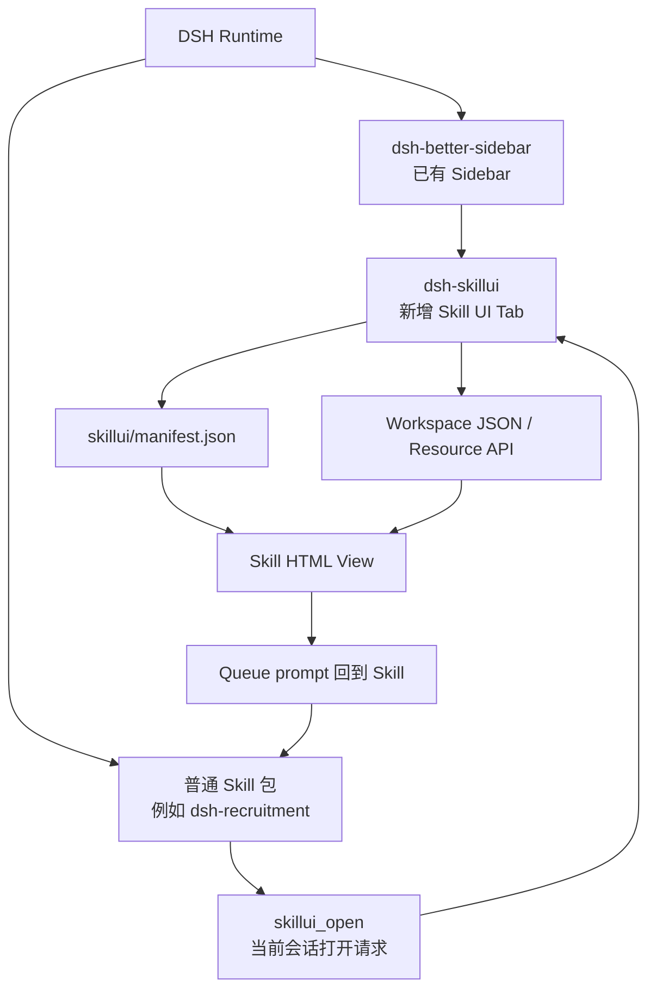
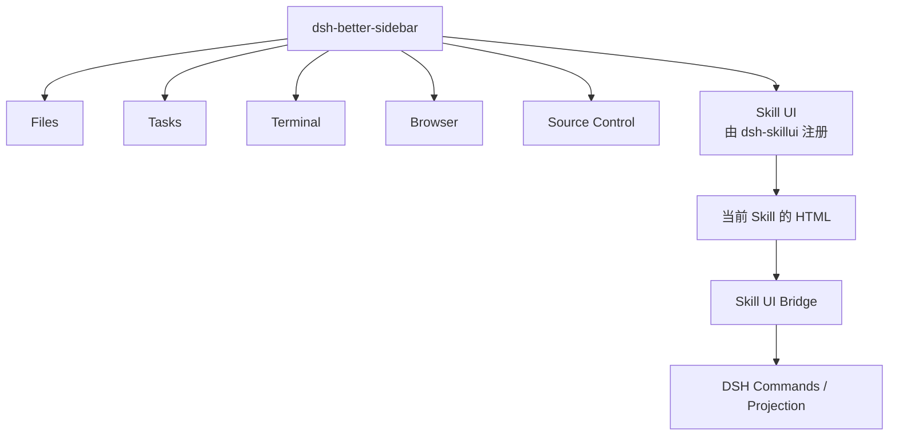
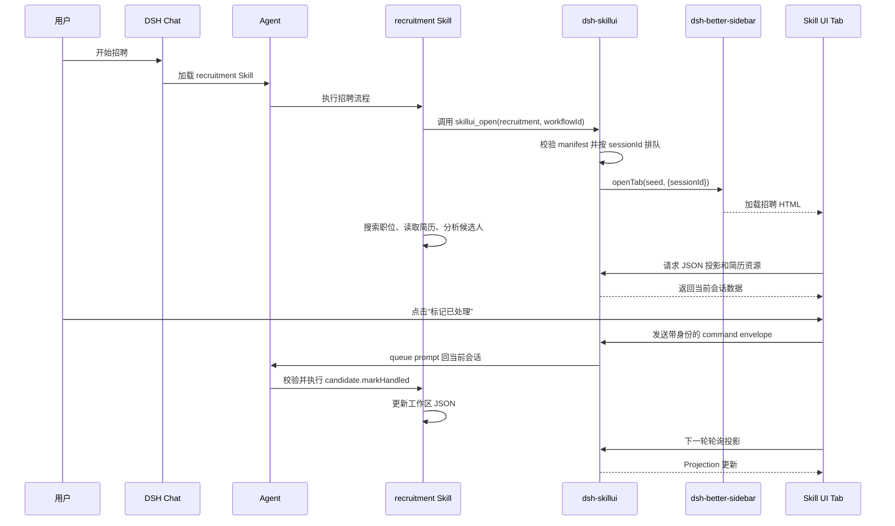

# DSH Skill UI 架构设计

## 1. 目标

在 `DSH-better-sidebar` 现有的一级 Tab 中增加一个同级的 `Skill UI` Tab，专门用于展示具有交互界面的 Skill HTML，并让 HTML 界面与 DSH Skill、Workflow 和 Session 联动。

当前实现构建通用框架和一个 Demo，并支持通过标准 Skill 包接入招聘等实际业务；业务仍不进入本仓库。

## 2. 核心决策

不 fork `DSH-better-sidebar`。`dsh-skillui` 作为独立的 DSH 插件，通过 `ctx.betterSidebar.registerTab(...)` 注册一个新的一级 Tab。

只有当需要修改 Sidebar 的公共基础能力，例如整体布局、Tab 渲染机制、停靠区域、通用生命周期或权限机制时，才考虑维护 `dsh-better-sidebar` 的 fork。

## 3. 用户看到的结构

`Skill UI` 与 Files、Tasks、Terminal、Browser、Source Control 同级：

```text
DSH-better-sidebar
├── Files
├── Tasks
├── Terminal
├── Browser
├── Source Control
└── Skill UI              ← dsh-skillui 注册的新 Tab
```

点击 `Skill UI` 后，Tab 内容区域直接展示当前 Skill 的 HTML：

```text
Skill UI Tab
└── 当前 Skill 的 HTML 页面
    ├── 流程状态
    ├── 结果展示
    └── 交互按钮
```

## 4. 总体架构



## 5. Sidebar 层级



## 6. 招聘 Skill 的运行过程



确定性的操作，例如暂停、恢复、标记候选人，当前通过带结构化 payload 的 queue prompt 回到当前会话，由 Skill 校验执行；后续可以把桥升级为原生 DSH Command。需要模型推理的操作，例如分析简历、筛选候选人、撰写联系内容，仍交给 Agent、Tool 或 Workflow。

## 7. 各组件职责

### dsh-better-sidebar

- 提供 Sidebar 和一级 Tab 容器；
- 管理 Tab 的打开、关闭、切换和布局；
- 不包含招聘、社媒或旅行等业务逻辑。

### dsh-skillui

- 注册 `Skill UI` 一级 Tab；
- 扫描用户级和工作区 Skill 根目录中的 `skillui/manifest.json`；
- 注册 `skillui_open`，绑定调用它的 DSH session 并排队打开请求；
- 接收 `sessionId`、`skillId`、`workflowId`；
- 加载当前 Skill 的 HTML；
- 建立 HTML 与 DSH 之间的通信桥；
- 将 UI 操作转换为当前会话的 queue prompt；
- 读取 workspace JSON / 白名单资源并向 HTML 提供当前状态。

### 具体 Skill 包

例如 `dsh-recruitment`：

- 提供 `SKILL.md`；
- 提供招聘流程、Tool 和 Workflow；
- 管理职位、候选人和处理状态；
- 在进入工作台时调用 `skillui_open`；
- 提供 `skillui/manifest.json` 与招聘 HTML 页面。

## 8. Skill UI 的最小协议

每个可交互 Skill 至少需要声明：

```text
SkillUiDefinition
├── skillId
├── title
├── entry                 HTML 入口
├── state                 UI 读取的状态声明
├── commands              UI 可触发的命令
├── sessionId             所属会话
├── workflowId            当前流程
└── resources             文件、图片等资源白名单
```

UI 和 Skill 的联动路径：

```text
用户点击按钮
    ↓
Skill UI 发出带 identity 的 command envelope
    ↓
dsh-skillui 校验身份与 manifest 命令白名单
    ↓
转换为当前会话的 queue prompt
    ↓
招聘 Skill 校验、执行并写入工作区数据
    ↓
JSON projection 更新
    ↓
Skill UI 刷新
```

## 9. HTML 迁移策略

当前可以保留 Skill 的静态 HTML，通过 Tab 内部的 iframe 加载：

```text
Skill UI Tab
└── iframe
    └── 用户 Skill 根目录/<skill>/views/index.html
```

这样可以复用现有 HTML UI，不必立即重写为 React。后续再逐步切换为 DSH Client Module。

现有 HTML 中的视觉结构可以直接复用；`postMessage` 现在使用 `dsh-skillui:command` envelope，确定性业务仍由具体 Skill 执行。workspace JSON 轮询是当前可用投影方式，后续可替换为 Session 事件推送。

## 10. 当前验收标准

1. `dsh-skillui` 能以独立插件加载；
2. `Skill UI` 在 Sidebar 中与 Files、Tasks、Terminal 等 Tab 同级显示；
3. Tab 能展示一个 Demo Skill HTML；
4. Demo HTML 能读取当前 Session 的 Projection；
5. 安装的 Skill 能通过 `skillui_open` 打开自己的 HTML；
6. View 命令能回到当前会话并由具体 Skill 执行；
7. workspace JSON 和资源路径不能越过声明的根目录；
8. 新增第二个 Skill UI 时，不修改 `dsh-better-sidebar` 和通用 Tab 代码。

## 11. 非目标

- 不在本仓库包含现有 `skill-app-hermes` 的招聘业务；业务位于独立的 `dsh-recruitment` Skill 包；
- 不在通用 Runtime 中实现招聘业务；
- 不实现生产级 Workflow；
- 不实现跨 Session 任务管理；
- 不修改 `dsh-better-sidebar` 源码；
- 不在通用 Runtime 中引入真实业务模型依赖。
