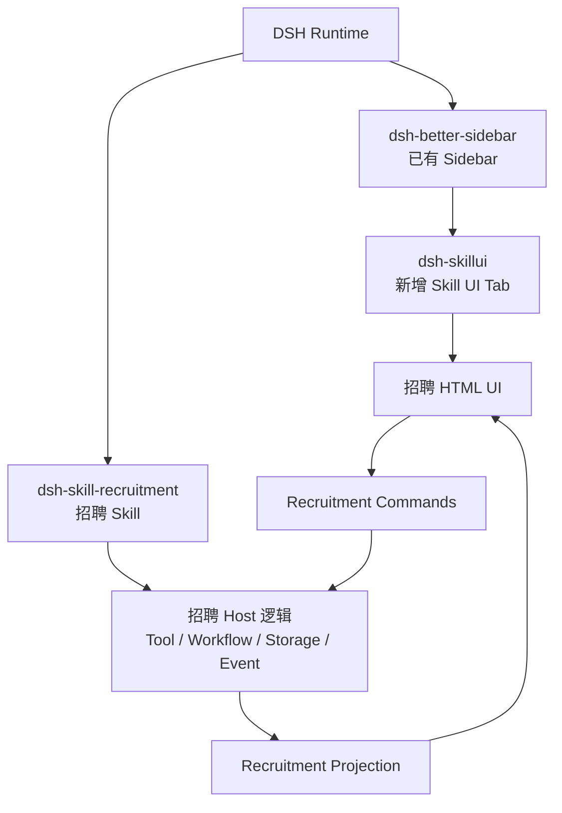
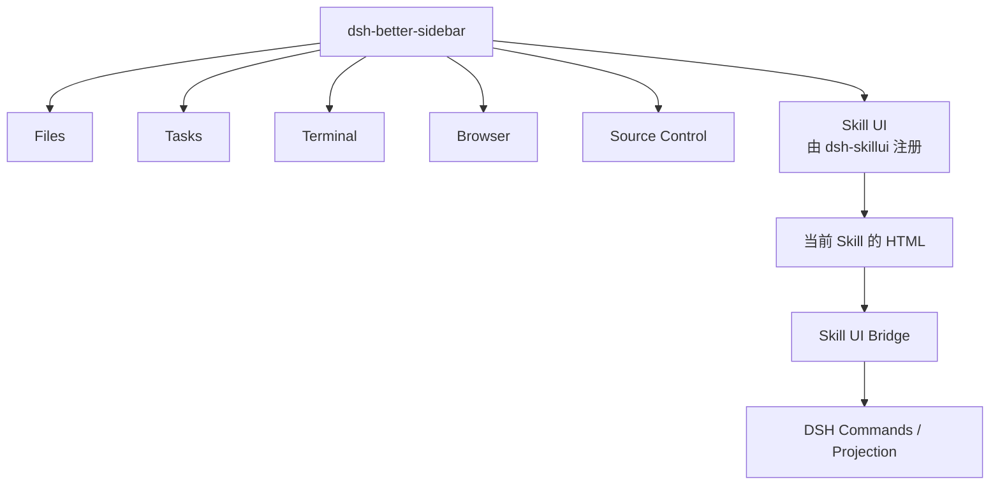
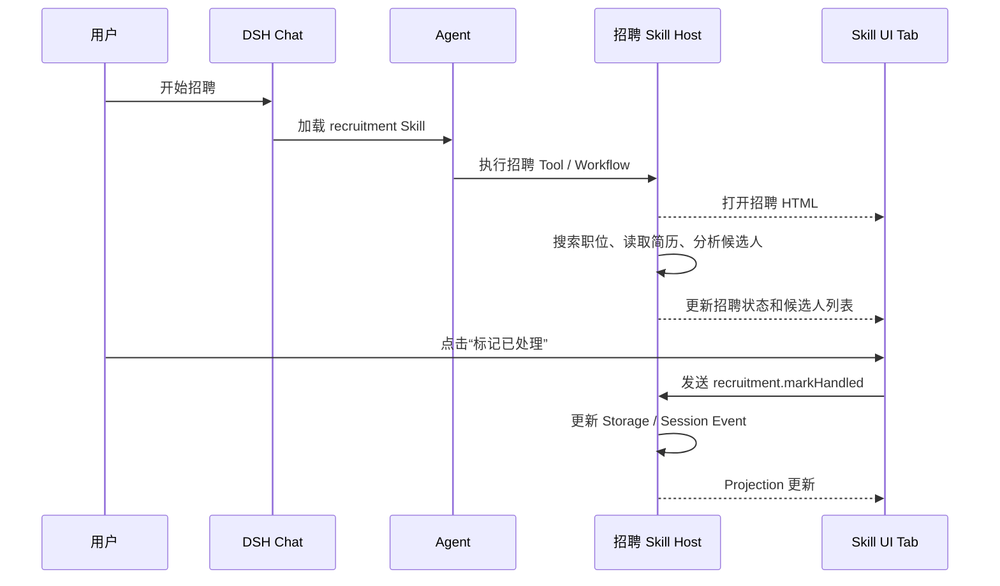

# DSH Skill UI 架构设计

## 1. 目标

在 `DSH-better-sidebar` 现有的一级 Tab 中增加一个同级的 `Skill UI` Tab，专门用于展示具有交互界面的 Skill HTML，并让 HTML 界面与 DSH Skill、Workflow 和 Session 联动。

第一阶段只构建通用框架骨架和一个 Demo Skill UI，不迁移现有 `skill-app-hermes` 业务。

## 2. 核心决策

不 fork `DSH-better-sidebar`。`dsh-skillui` 作为独立的 DSH 插件，通过 `ctx.betterSidebar.registerTab(...)` 注册一个新的一级 Tab。

只有当需要修改 Sidebar 的公共基础能力，例如整体布局、Tab 渲染机制、停靠区域、通用生命周期或权限机制时，才考虑维护 `dsh-better-sidebar` 的 fork。

## 3. 用户看到的结构

`Skill UI` 与 Files、Tasks、Terminal、Browser、Source Control 同级：

```text
DSH-better-sidebar
├── Files
├── Tasks
├── Terminal
├── Browser
├── Source Control
└── Skill UI              ← dsh-skillui 注册的新 Tab
```

点击 `Skill UI` 后，Tab 内容区域直接展示当前 Skill 的 HTML：

```text
Skill UI Tab
└── 当前 Skill 的 HTML 页面
    ├── 流程状态
    ├── 结果展示
    └── 交互按钮
```

## 4. 总体架构



## 5. Sidebar 层级



## 6. 招聘 Skill 的运行过程



确定性的操作，例如暂停、恢复、标记候选人，直接通过 DSH Command 执行，不需要重新发送自然语言消息。需要模型推理的操作，例如分析简历、筛选候选人、撰写联系内容，再交给 Agent、Tool 或 Workflow。

## 7. 各组件职责

### dsh-better-sidebar

- 提供 Sidebar 和一级 Tab 容器；
- 管理 Tab 的打开、关闭、切换和布局；
- 不包含招聘、社媒或旅行等业务逻辑。

### dsh-skillui

- 注册 `Skill UI` 一级 Tab；
- 接收 `sessionId`、`skillId`、`workflowId`；
- 加载当前 Skill 的 HTML；
- 建立 HTML 与 DSH 之间的通信桥；
- 将 UI 操作转成 Typed Command；
- 读取 Projection 并向 HTML 提供当前状态。

### 具体 Skill Plugin

例如 `dsh-skill-recruitment`：

- 提供 `SKILL.md`；
- 提供招聘 Tool 和 Workflow；
- 管理职位、候选人和处理状态；
- 注册 Recruitment Commands；
- 产生 Recruitment Events；
- 提供招聘 HTML 页面。

## 8. Skill UI 的最小协议

每个可交互 Skill 至少需要声明：

```text
SkillUiDefinition
├── skillId
├── title
├── htmlEntry             HTML 入口
├── stateProjection       UI 读取的状态
├── commands              UI 可触发的命令
├── sessionId             所属会话
├── workflowId            当前流程
└── capabilities          文件、图片、浏览器等能力
```

UI 和 Skill 的联动路径：

```text
用户点击按钮
    ↓
Skill UI 发出 Typed Command
    ↓
DSH Host 校验并执行
    ↓
写入 Session Event / Storage
    ↓
Projection 更新
    ↓
Skill UI 刷新
```

## 9. HTML 迁移策略

第一阶段可以保留 Skill 的静态 HTML，通过 Tab 内部的 iframe 加载：

```text
Skill UI Tab
└── iframe
    └── .dsh/skills/<skill>/views/index.html
```

这样可以复用现有 HTML UI，不必立即重写为 React。后续再逐步切换为 DSH Client Module。

现有 HTML 中的 `postMessage` 可以保留为临时通信形式，但最终需要转换为 DSH Typed Command；现有 Next.js JSON 轮询则逐步替换为 DSH Projection。

## 10. 第一阶段验收标准

1. `dsh-skillui` 能以独立插件加载；
2. `Skill UI` 在 Sidebar 中与 Files、Tasks、Terminal 等 Tab 同级显示；
3. Tab 能展示一个 Demo Skill HTML；
4. Demo HTML 能读取当前 Session 的 Projection；
5. 点击 Demo 按钮能调用 Typed Command；
6. Command 执行后，Session Event 和 Projection 更新；
7. 刷新或回放 Session 后，Demo UI 状态仍然正确；
8. 新增第二个 Demo UI 时，不修改 `dsh-better-sidebar` 和通用 Tab 代码。

## 11. 非目标

- 不迁移现有 `skill-app-hermes`；
- 不实现招聘业务；
- 不实现生产级 Workflow；
- 不实现跨 Session 任务管理；
- 不修改 `dsh-better-sidebar` 源码；
- 不在第一阶段引入真实模型依赖。
