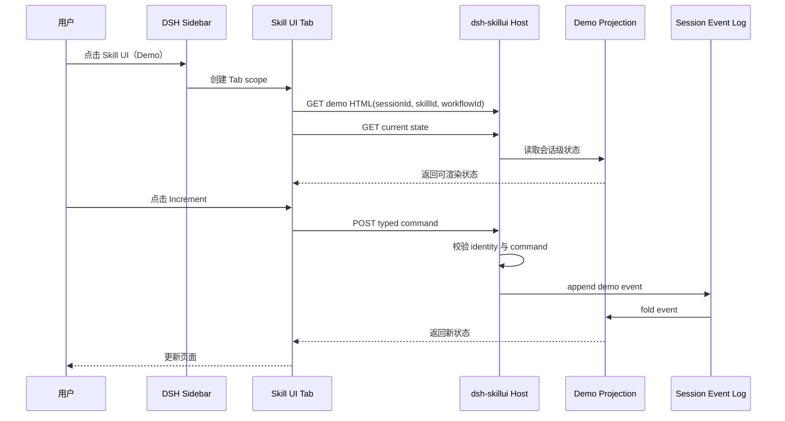

# dsh-skillui MVP 设计规格

> 该文档记录 Demo MVP 的设计基线；实际 Skill 包接入和当前实现以 `README.md` 与 `docs/skill-ui-architecture.md` 为准。

## 背景

目标是在 `DSH-better-sidebar` 的一级 Tab 中增加一个与 Files、Tasks、Terminal、Browser、Source Control 同级的 `Skill UI`。这个 Tab 不承载具体招聘业务，而是负责承载任意 Skill 提供的交互式 HTML，并把界面操作连接到 DSH 的会话、命令和状态投影。

本阶段实现一个可运行的 Demo Skill UI，并验证标准 Skill 包通过 manifest、`skillui_open` 和会话桥接接入；招聘 Skill 仍作为独立 Skill 包存在，不写入 `dsh-skillui` 的通用业务代码。

## 决策

采用独立插件方案，不 fork 或修改 `DSH-better-sidebar`。本地依赖使用 npm 当前可安装的 `dsh-better-sidebar@0.16.1`；GitHub 主分支上出现的更高版本仍使用同一组 `registerTab` / `TabDescriptor` 边界。WebServer 只作为 DSH 运行时提供的宿主服务，不在插件内部重新安装或启动：

```text
DSH Runtime
├── dsh-better-sidebar
└── dsh-skillui
    ├── host: HTTP/command/state bridge
    └── client: registers sibling Skill UI tab
```

`dsh-skillui` 通过 `ctx.betterSidebar.registerTab(...)` 注册 Tab。只有公共 Sidebar 的布局、停靠或通用生命周期需要改变时，才需要维护 `DSH-better-sidebar` 的 fork。

## 用户流程



招聘 Skill 的目标运行过程在 `docs/skill-ui-architecture.md` 中保留，尤其是其中的招聘时序图；本 MVP 只把该时序中的通用链路用 Demo Skill 验证。

## 模块边界

### Client

- 从 `TabComponentProps` 读取 `scope.sessionId` 和 `tab.meta`；
- 向 `dsh-better-sidebar` 注册唯一的 `Skill UI` Tab；
- 在 Tab 内容区加载 Skill HTML iframe；
- 在 iframe 消息与宿主 HTTP bridge 之间传递可验证的 identity；
- Tab 不包含招聘或其他具体领域逻辑。

### Host

- 扫描已安装 Skill 的 `skillui/manifest.json`，注册 `/skillui/views/:skillId/*` 和 `/skillui/api/*` 路由；
- 只暴露 manifest 声明的 Skill UI 页面、workspace 文件和资源；
- 注册 `skillui_open`，绑定调用它的 DSH session 并排队打开请求；
- 校验 `sessionId`、`skillId`、`workflowId` 与 command 类型；
- 将 Demo command 转换为事件，并通过纯 reducer 生成当前 projection；
- 将通用 UI command 转成当前会话的 queue prompt；Demo 仍使用确定性的内存 adapter。

### Skill UI 页面

页面只依赖稳定的浏览器端协议：

```ts
GET  /skillui/api/data/:skillId/:declared-file?sessionId=...&skillId=...&workflowId=...
GET  /skillui/api/resource/:skillId/:allowed-path?sessionId=...&skillId=...&workflowId=...
POST message to parent
     { type: 'dsh-skillui:command', identity, command: { type, requestId, payload } }
```

页面不直接访问 DSH 内部对象，也不发送自然语言消息来完成确定性操作。

## 核心数据协议

```ts
type SkillUiIdentity = {
  sessionId: string
  skillId: string
  workflowId: string
}

type SkillUiCommand =
  | { type: 'demo.increment'; requestId: string }
  | { type: 'demo.reset'; requestId: string }

type DemoState = {
  version: 1
  identity: SkillUiIdentity
  count: number
  lastCommand?: SkillUiCommand['type']
}
```

事件 reducer 是纯函数，单元测试覆盖初始状态、增量、重置和未知 identity。这样未来可以把相同 reducer 接到 DSH Session Projection，而不把状态逻辑复制到 HTML 或 Sidebar。

## iframe 安全边界

- 页面来源只能来自本插件显式注册的 Skill UI 资源；
- iframe 使用 sandbox，允许脚本和同源请求以支持 API bridge；
- command body 只接受白名单 command 和字符串 identity；
- API 不接受任意文件路径，不根据用户输入拼接磁盘路径；
- 页面通过 `postMessage` 接收 Tab visibility，隐藏时停止轮询。

## 验收标准

1. `dsh.plugin.json`、host entry 和 client registry 结构符合 DSH 插件约定；
2. client 注册一个 `Skill UI` sibling tab，且注册有 disposer；
3. Tab 能以当前 `scope.sessionId` 加载 Demo HTML；
4. Demo HTML 能读取 state、发送 `demo.increment` 和 `demo.reset`；
5. 同一个 session/workflow 的刷新不会丢失 Demo 状态；
6. reducer、协议校验、HTTP command bridge 有自动化测试；
7. 构建产物包含 host bundle、client registry 和 demo HTML；
8. 新增实际招聘 UI 时只需注册新的 Skill UI definition，不修改 Sidebar。

## 非目标

- 本阶段不迁移 `skill-app-hermes` 的招聘业务；
- 不 fork `DSH-better-sidebar`；
- 不引入真实模型调用；
- 不把 HTML 页面重写成 React；
- 不声称当前本地环境已经完成真实 `dsh web` 启动验证，除非安装并运行 DSH CLI 后再次验证。
